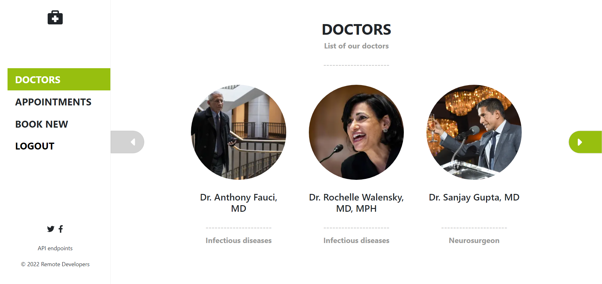

# Doctors Appointment Project

This app is an implementation of the design of [Murat Korkmaz](https://www.behance.net/gallery/26425031/Vespa-Responsive-Redesign) from Behance for a doctor booking app.

Back-end is built with rails according to RESTful api principles. [Click here](https://doctors-appointment-project.herokuapp.com/api-docs/) to see OpenAPI-compliant endpoints.

Front-end is built with React according to mobile first, responsive design principles.

### Live version

Please wait 20 to 30 seconds until the app loads.
It might take longer than usual for heroku servers to load the app because its a free server.
[Click here](https://doctors-appointment-project.herokuapp.com/) for live version.

### Built with

- Back-end
  - Rails
  - PostgreSQL
- Front-end
  - React
  - Bootstrap
  - SASS
  - MaterialUI
  - Redux/toolkit for global state
  - Redux/toolkit/RTK Query for api state.
- Testing
  - RSpec, RSwag, Pry
    - [Click here](./spec/requests/api/appointment_spec.rb) for specs used to build OpenAPI documentation.
- Authentication
  - Devise and JWT used for simple authentication.

### API

[Click here for SwaggerUI](https://doctors-appointment-project.herokuapp.com/api-docs/)

[Click for OpenAPI yaml](https://doctors-appointment-project.herokuapp.com/v1/swagger.yaml)

### Author

👤 **damdafayton**

- GitHub: [@damdafayton](https://github.com/damdafayton)
- LinkedIn: [Damda Fayton](https://www.linkedin.com/in/damdafayton/)

### 🤝 Contributions

Design by [Murat Korkmaz](https://www.behance.net/gallery/26425031/Vespa-Responsive-Redesign) from Behance.

Contributions, issues, and feature requrests are welcome!

Feel free to check the [issues page](https://github.com/muneebulrehman/doctors-appointment-backend/issues).

### 📝 License

This project is MIT licensed.
